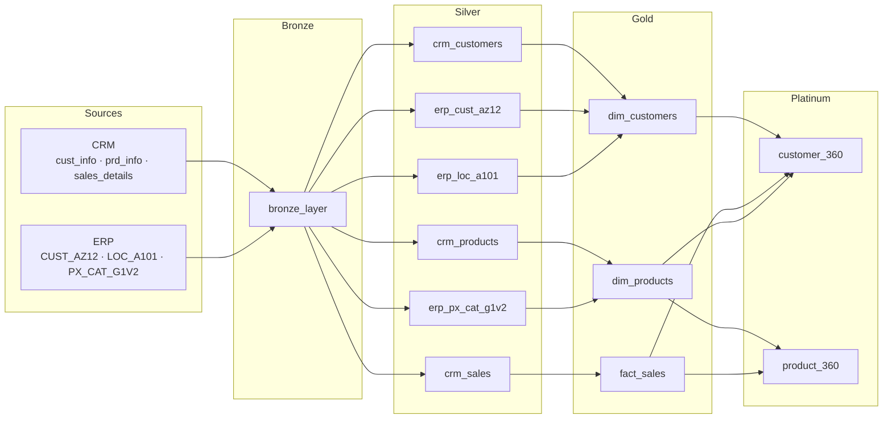

# Bike Data Lakehouse Project

A complete Data Lakehouse built from scratch on **Databricks**, implementing an extended **Medallion Architecture** (Bronze → Silver → Gold → Platinum) to consolidate data from two heterogeneous source systems — a CRM and an ERP — into business-ready analytical tables.

📚 **Documentation:** [`docs/data_catalog.md`](docs/data_catalog.md) · [`docs/dictionary/`](docs/dictionary/)

---

## Architecture

| Layer | Purpose | Tables |
|---|---|---|
| **Bronze** | Raw ingestion — CSVs loaded as-is, never modified | 6 |
| **Silver** | Typed, cleaned, deduplicated — one table per source | 6 |
| **Gold** | Cross-source joins — star schema (dim + fact) | 3 |
| **Platinum** | Business analytics — 360° views, scoring, segmentation | 2 |

All tables are stored as **Delta format** in the `data_lakehouse_project` Databricks catalog.

---

## Databricks Job — Automated Daily Pipeline

The full pipeline is orchestrated as a **Databricks Workflow**, scheduled every day at **04:00 AM**.

### Pipeline DAG

Bronze triggers all Silver notebooks in parallel. Gold tasks fire as soon as their Silver dependencies complete. Platinum runs last, once the full Gold layer is ready.

### Execution Timeline

| Task | Duration |
|---|---|
| `bronze_layer` | 1m 32s |
| `silver_layer_*` (× 6, parallel) | 22s – 1m 8s |
| `gold_layer_dim_customers` | 18s |
| `gold_layer_dim_products` | 16.7s |
| `gold_layer_fact_sales` | 13.7s |
| `platinium_layer_customer_360` | 22.7s |
| `platinium_layer_product_360` | 21.7s |

**Total end-to-end: ~4 minutes.**

---

## Notebook Execution Order

### 1 · Bronze — `01_Bronze_Layer_Notebook/bronze_layer.ipynb`

Reads 6 raw CSVs from Databricks Volumes and loads them as-is into the `bronze` schema.

| Source | Volume path | Bronze table |
|---|---|---|
| CRM | `source_crm/cust_info.csv` | `bronze.crm_cust_info` |
| CRM | `source_crm/prd_info.csv` | `bronze.crm_prd_info` |
| CRM | `source_crm/sales_details.csv` | `bronze.crm_sales_details` |
| ERP | `source_erp/CUST_AZ12.csv` | `bronze.erp_cust_az12` |
| ERP | `source_erp/LOC_A101.csv` | `bronze.erp_loc_a101` |
| ERP | `source_erp/PX_CAT_G1V2.csv` | `bronze.erp_px_cat_g1v2` |

→ Column details: [`docs/dictionary/01_bronze.md`](docs/dictionary/01_bronze.md)

### 2 · Silver — `02_Silver_Layer_Notebooks/`

One PySpark notebook per source table. Key transformations:

**CRM:**
- `crm_cust_info` → `crm_customers`: deduplication, string normalization (gender, marital status), key cleaning
- `crm_prd_info` → `crm_products`: `prd_key` split into `category_id` + `product_key`, NULL cost imputation via window average
- `crm_sales_details` → `crm_sales`: `YYYYMMDD` integer → `date`, cross-imputation of `sales` / `price`

**ERP:**
- `erp_cust_az12` → `erp_cust_az12`: customer key normalization, gender normalization via regex
- `erp_loc_a101` → `erp_loc_a101`: customer key normalization, country standardization (US variants → `USA`, DE variants → `Germany`)
- `erp_px_cat_g1v2` → `erp_px_cat_g1v2`: ID normalization (`_` → `-`)

→ Column details: [`docs/dictionary/02_silver_crm.md`](docs/dictionary/02_silver_crm.md) · [`docs/dictionary/03_silver_erp.md`](docs/dictionary/03_silver_erp.md)

### 3 · Gold — `03_Gold_Layer_Notebooks/`

Cross-source joins producing the star schema. No aggregation or business logic.

- `dim_customers`: `crm_customers` + `erp_loc_a101` + `erp_cust_az12` (join on `customer_key`)
- `dim_products`: `crm_products` + `erp_px_cat_g1v2` (join on `category_id`)
- `fact_sales`: direct promotion of `crm_sales`

→ Column details: [`docs/dictionary/04_gold.md`](docs/dictionary/04_gold.md)

### 4 · Platinum — `04_Platinium_Layer_Notebook/`

Pure Databricks SQL (`CREATE OR REPLACE TABLE`). All time-based metrics use `MAX(order_date)` from `fact_sales` as reference — not `CURRENT_DATE`.

- **`customer_360`**: customer demographics + purchase aggregates + RFMV scoring (NTILE quintiles) + segment label (VIP / Premium / Standard / At Risk / Dormant)
- **`product_360`**: product catalogue + sales performance + logistics metrics + RFM scoring + ABC Pareto classification (A = top 80% revenue)

→ Full column details + formulas: [`docs/dictionary/05_platinum_customer_360.md`](docs/dictionary/05_platinum_customer_360.md) · [`docs/dictionary/06_platinum_product_360.md`](docs/dictionary/06_platinum_product_360.md)

---

## Key Design Decisions

- **Extended medallion — Platinum layer**: Gold stays lean (joins only). All scoring, segmentation, and aggregation lives in Platinum — separated by concern, independently evolvable.
- **MAX(order_date) as temporal anchor**: Using the dataset's own max date instead of `CURRENT_DATE` makes the pipeline fully reproducible regardless of when it runs.
- **RFMV instead of RFM**: A fourth dimension — Value (average order value) — distinguishes high-spend infrequent buyers from high-frequency low-value customers.
- **ABC Pareto on products**: Running cumulative revenue share (`SUM() OVER (ORDER BY total_sales DESC)`) classifies products into A (≤ 80%), B (≤ 95%), C (> 95%) for inventory prioritization.
- **Cross-source key normalization**: CRM (`cst_key`) and ERP (`CID`) used different formats for the same customer identifier. Both normalized to the same format (remove `-`, remove `NAS` prefix) before Gold joins.
- **NULL cost imputation**: 2 products with missing `prd_cost` imputed via window average over the first 12 chars of product name (product family proxy) — preserving row count integrity.
- **Date parsing from integers**: ERP dates stored as `YYYYMMDD` integers — parsed by inserting separators and casting to `date` in Silver.

---

## Stack

| Tool | Role |
|---|---|
| Databricks | Compute + catalog + notebook environment + workflow orchestration |
| PySpark | Data transformation — Silver layer |
| Databricks SQL | Dimensional joins (Gold) + analytical CTEs, window functions, NTILE (Platinum) |
| Delta Lake | Storage format for all 17 tables |
| Databricks Workflows | Daily 04:00 AM job — 12-task DAG with parallel Silver + parallel Platinum |
