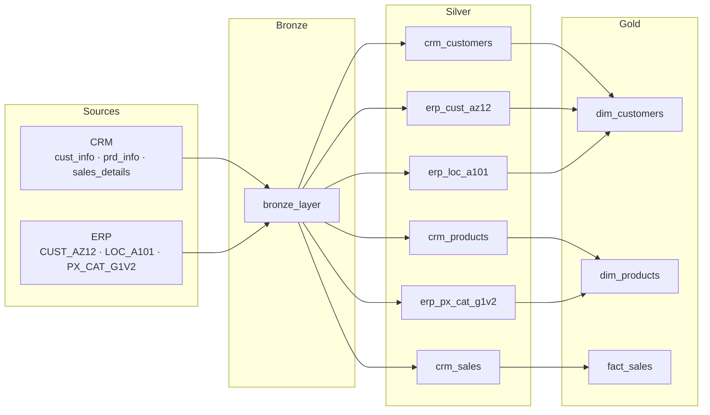

# Bike Data Lakehouse Project

A complete Data Lakehouse built from scratch on **Databricks**, implementing the **Medallion Architecture** (Bronze → Silver → Gold) to consolidate and transform data from two heterogeneous source systems — a CRM and an ERP — into analytics-ready Delta tables.

---

## Architecture Overview



All tables are stored as **Delta format** in the `data_lakehouse_project` Databricks catalog.

---

## Gold Layer — Star Schema


The Gold layer follows a classic star schema:

- **`fact_sales`** — one row per order line: `order_number`, `customer_id`, `product_key`, `order_date`, `ship_date`, `due_date`, `sales`, `quantity`, `price`
- **`dim_customers`** — enriched from CRM + ERP: `customer_id`, `customer_key`, `firstname`, `lastname`, `marital_status`, `gender`, `birthdate`, `country`, `create_date`
- **`dim_products`** — enriched from CRM + ERP: `product_id`, `product_key`, `category_id`, `category`, `sub_category`, `product_name`, `product_cost`, `product_line`, `product_start_date`, `product_end_date`, `maintenance`

---

## Databricks Job — Automated Daily Pipeline

The full pipeline is orchestrated as a **Databricks Workflow**, scheduled to run every day at **04:00 AM**.

### Pipeline DAG


The Bronze notebook triggers all Silver notebooks in parallel. Each Gold notebook starts only once its upstream Silver dependencies have completed.

### Execution Timeline (sample run — Apr 28)


| Task | Duration |
|---|---|
| `bronze_layer` | 33.5s |
| `silver_layer_cat_g1v2` | 22.8s |
| `silver_layer_cust_az12` | 29.7s |
| `silver_layer_cust_info` | 27.8s |
| `silver_layer_loc_a101` | 25.3s |
| `silver_layer_prd_info` | 30.5s |
| `silver_layer_sales_details` | 1m 6s |
| `gold_layer_dim_customers` | 5m 15s |
| `gold_layer_dim_products` | 14.2s |
| `gold_layer_fact_sales` | 12.9s |

Total end-to-end run: ~7 minutes. The Silver layer runs fully in parallel after Bronze; Gold tasks start as soon as their Silver dependencies complete.

---

## Notebook Execution Order

### 1. Bronze — `01_Bronze_Layer_Notebook/bronze_layer.ipynb`

Reads raw CSVs from Databricks Volumes and loads them as-is into the bronze schema.

| Source | Volume path | Bronze table |
|---|---|---|
| CRM | `source_crm/cust_info.csv` | `bronze.crm_cust_info` |
| CRM | `source_crm/prd_info.csv` | `bronze.crm_prd_info` |
| CRM | `source_crm/sales_details.csv` | `bronze.crm_sales_details` |
| ERP | `source_erp/CUST_AZ12.csv` | `bronze.erp_cust_az12` |
| ERP | `source_erp/LOC_A101.csv` | `bronze.erp_loc_a101` |
| ERP | `source_erp/PX_CAT_G1V2.csv` | `bronze.erp_px_cat_g1v2` |

---

### 2. Silver — `02_Silver_Layer_Notebooks/`

Each notebook handles one source table. Transformations are applied with PySpark and output is written as Delta.

#### CRM notebooks

**`crm/silver_layer_crm_cust_info.ipynb`** → `silver.crm_customers`
- Deduplication on `cst_id`, null removal
- Trim all strings
- Normalize marital status (`M` → `Married`, `S` → `Single`)
- Normalize gender (`M` → `Male`, `F` → `Female`)
- Clean `cst_key`: remove `-` and `NAS` prefix
- Rename all columns to readable names

**`crm/silver_layer_crm_prd_info.ipynb`** → `silver.crm_products`
- Trim all strings
- Split `prd_key` into `category_id` (first 5 chars) and `product_key` (from char 7)
- Impute 2 NULL costs via window average over product name prefix (12 chars), cast to int
- Replace NULL `prd_line` with `"N/A"`
- Rename all columns

**`crm/silver_layer_crm_sales_details.ipynb`** → `silver.crm_sales`
- Trim + uppercase all strings
- Cross-impute NULLs between `sls_price` and `sls_sales` (values are equivalent)
- Parse date integers stored as `YYYYMMDD` integers → proper `date` type
- Rename all columns

#### ERP notebooks

**`erp/silver_layer_erp_cust_az12.ipynb`** → `silver.erp_cust_az12`
- Trim, uppercase `CID`, remove `-` and `NAS` (to match CRM customer key format)
- Normalize gender using regex (`F*` → `Female`, `M*` → `Male`)
- Rename: `CID` → `customer_key`, `BDATE` → `birthdate`, `GEN` → `gender`

**`erp/silver_layer_erp_loc_a101.ipynb`** → `silver.erp_loc_a101`
- Trim, uppercase + clean `CID` (same key normalization as above)
- Normalize country: `NULL`/empty → `N/A`, US variants → `USA`, DE variants → `Germany`
- Rename: `CID` → `customer_key`, `CNTRY` → `country`

**`erp/silver_layer_erp_px_cat_g1v2.ipynb`** → `silver.erp_px_cat_g1v2`
- Trim, uppercase `ID`, replace `_` with `-`
- Rename: `ID` → `id`, `CAT` → `category`, `SUBCAT` → `sub_category`, `MAINTENANCE` → `maintenance`

---

### 3. Gold — `03_Gold_Layer_Notebooks/`

Cross-source joins that produce the final dimensional model.

**`gold_layer_dim_customer.ipynb`** → `gold.dim_customers`

```sql
SELECT crm_c.*, erp_loc.country, erp_cust.birthdate
FROM silver.crm_customers AS crm_c
LEFT JOIN silver.erp_loc_a101  AS erp_loc  ON crm_c.customer_key = erp_loc.customer_key
LEFT JOIN silver.erp_cust_az12 AS erp_cust ON crm_c.customer_key = erp_cust.customer_key
```

**`gold_layer_dim_products.ipynb`** → `gold.dim_products`

```sql
SELECT prd.*, px.category, px.sub_category, px.maintenance
FROM silver.crm_products AS prd
LEFT JOIN silver.erp_px_cat_g1v2 AS px ON px.id = prd.category_id
```

**`gold_layer_fact_sales.ipynb`** → `gold.fact_sales`

Direct promotion of `silver.crm_sales` — no join needed, the sales table is already complete after Silver transformations.

---

## Sample Analytical Queries

```sql
-- Revenue by country
SELECT c.country, SUM(f.sales) AS total_revenue
FROM gold.fact_sales f
JOIN gold.dim_customers c ON f.customer_id = c.customer_id
GROUP BY c.country
ORDER BY total_revenue DESC;

-- Top 10 products by quantity sold
SELECT p.product_name, p.category, SUM(f.quantity) AS units_sold
FROM gold.fact_sales f
JOIN gold.dim_products p ON f.product_key = p.product_key
GROUP BY p.product_name, p.category
ORDER BY units_sold DESC
LIMIT 10;

-- Latest unit price per product (handles price history)
WITH prd_price AS (
  SELECT
    product_key,
    price / quantity AS unit_price,
    ROW_NUMBER() OVER (PARTITION BY product_key ORDER BY quantity ASC, order_date DESC) AS rn
  FROM gold.fact_sales
)
SELECT product_key, unit_price
FROM prd_price
WHERE rn = 1;
```

---

## Key Design Decisions

- **Key standardization across sources**: CRM and ERP used different formats for the same customer key (`cst_key` vs `CID`). Both were normalized by removing `-` and `NAS` prefixes before joining at the Gold layer.
- **NULL cost imputation**: Rather than dropping the 2 rows with missing `prd_cost`, costs were imputed via a window average grouped on the first 12 characters of the product name — a proxy for product family.
- **Date parsing**: ERP sale dates were stored as raw integers (`YYYYMMDD`). These were parsed by inserting separators and casting to `date`.
- **Cross-imputation for sales**: `sls_price` and `sls_sales` were found to carry the same value; NULLs in one were filled from the other.

---

## Stack

| Tool | Role |
|---|---|
| Databricks | Compute + catalog + notebook environment + workflow orchestration |
| PySpark | Data transformation (Silver layer) |
| Delta Lake | Storage format for all layers |
| Databricks SQL | Validation queries + Gold layer joins |
| Databricks Workflows | Daily job scheduling (04:00 AM) |
