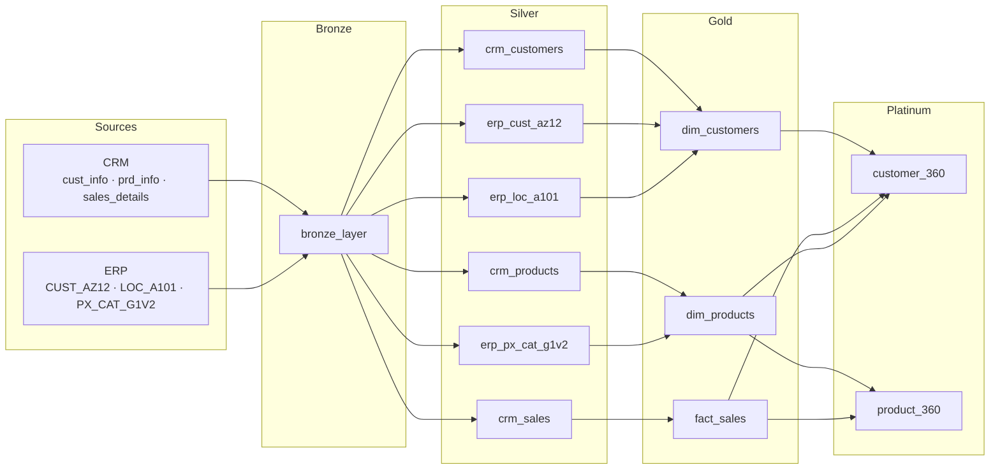
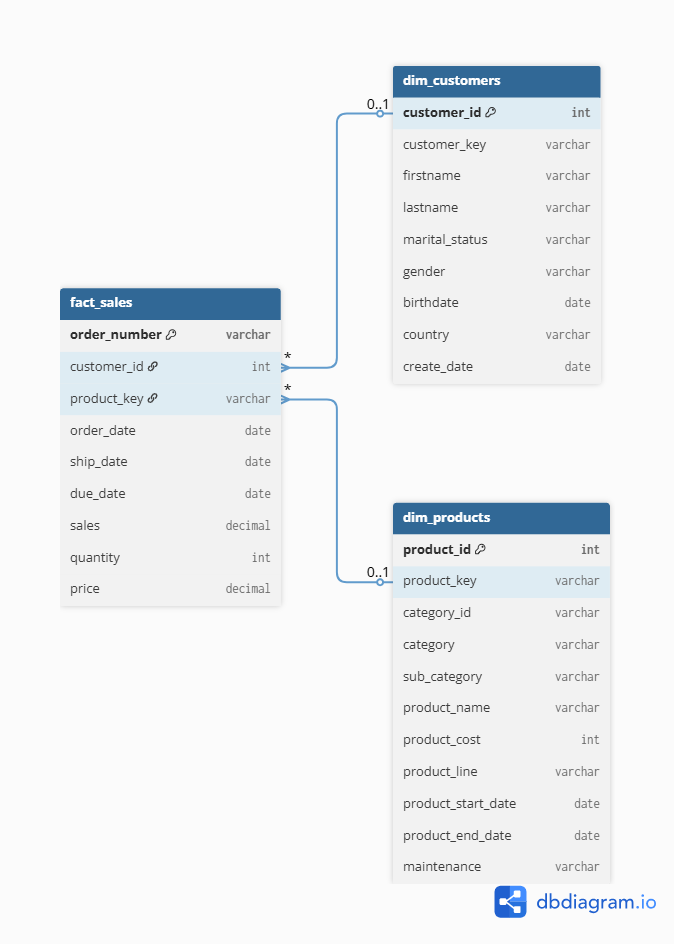
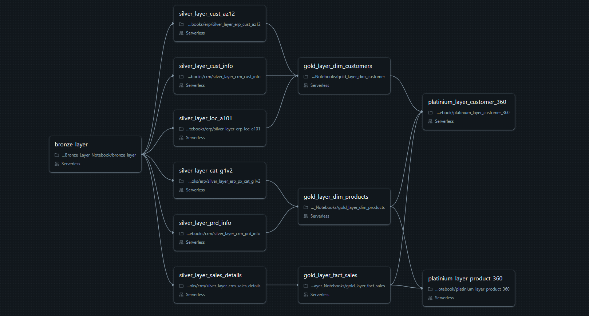
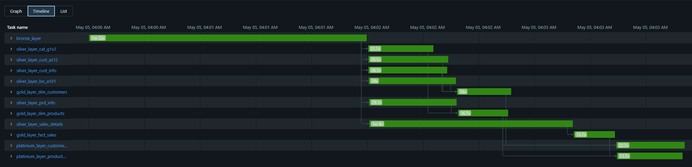

# Bike Data Lakehouse Project

A complete Data Lakehouse built from scratch on **Databricks**, implementing an extended **Medallion Architecture** (Bronze → Silver → Gold → Platinum) to consolidate and transform data from two heterogeneous source systems — a CRM and an ERP — into business-ready analytical tables.

---

## Architecture Overview



All tables are stored as **Delta format** in the `data_lakehouse_project` Databricks catalog across four schemas: `bronze`, `silver`, `gold`, `platinium`.

---

## Layer Responsibilities

| Layer | Purpose | Format |
|---|---|---|
| **Bronze** | Raw ingestion — CSVs loaded as-is, never modified | Delta |
| **Silver** | Typed, cleaned, deduplicated — one table per source | Delta |
| **Gold** | Cross-source joins — star schema dimensional model | Delta |
| **Platinum** | Business analytics — 360° views with scoring & segmentation | Delta |

---

## Gold Layer — Star Schema



The Gold layer follows a classic star schema:

- **`fact_sales`** — one row per order line: `order_number`, `customer_id`, `product_key`, `order_date`, `ship_date`, `due_date`, `sales`, `quantity`, `price`
- **`dim_customers`** — enriched from CRM + ERP: `customer_id`, `customer_key`, `firstname`, `lastname`, `marital_status`, `gender`, `birthdate`, `country`, `create_date`
- **`dim_products`** — enriched from CRM + ERP: `product_id`, `product_key`, `category_id`, `category`, `sub_category`, `product_name`, `product_cost`, `product_line`, `product_start_date`, `product_end_date`, `maintenance`

---

## Platinum Layer — Business Analytics

The Platinum layer materializes two wide analytical tables by aggregating and scoring the Gold dimensional model. All time-based metrics use `MAX(order_date)` from `fact_sales` as the reference date — not `CURRENT_DATE` — so results remain consistent and reproducible regardless of when the pipeline runs.

### `customer_360`

One row per customer, combining demographic data with behavioural analytics and RFMV segmentation.

| Column | Type | Description |
|---|---|---|
| `customer_id` | int | PK |
| `fullname` | varchar | firstname + lastname |
| `gender` | varchar | |
| `birthdate` | date | |
| `age` | int | Calculated from MAX(order_date) |
| `country` | varchar | |
| `first_order` | date | |
| `last_order` | date | |
| `total_orders` | bigint | Distinct order count |
| `total_sales` | bigint | |
| `total_quantity` | bigint | |
| `avg_order_value` | double | total_sales / total_orders |
| `avg_days_between_delivery_and_order` | double | |
| `first_product_ordered` | varchar | First product ever purchased |
| `top_category` | varchar | Category with most units bought |
| `top_subcategory` | varchar | Sub-category with most units bought |
| `top_product` | varchar | Product with most units bought |
| `days_since_last_order` | int | Relative to MAX(order_date) |
| `r_score` | int | Recency quintile (1–5) |
| `f_score` | int | Frequency quintile (1–5) |
| `m_score` | int | Monetary quintile (1–5) |
| `v_score` | int | Value (avg order) quintile (1–5) |
| `rfmv_score` | double | Average of R/F/M/V scores |
| `rfmv_segment` | varchar | VIP / Premium / Standard / At Risk / Dormant |

**RFMV Segmentation thresholds:**

| Segment | Score range |
|---|---|
| VIP | ≥ 4.5 |
| Premium | ≥ 3.5 |
| Standard | ≥ 2.5 |
| At Risk | ≥ 1.5 |
| Dormant | < 1.5 |

### `product_360`

One row per product, combining catalogue data with sales performance, logistics metrics, RFM scoring, and ABC classification.

| Column | Type | Description |
|---|---|---|
| `product_id` | int | PK |
| `product_name` | varchar | |
| `sub_category` | varchar | |
| `category` | varchar | |
| `product_line` | varchar | |
| `product_start_date` | date | |
| `first_order` | date | |
| `last_order` | date | |
| `days_since_last_order` | int | Relative to MAX(order_date) |
| `last_ship` | date | |
| `last_due` | date | |
| `avg_ship_days` | double | ship_date − order_date |
| `avg_delivery_days` | double | due_date − ship_date |
| `avg_total_preparation_days` | double | due_date − order_date |
| `price` | int | |
| `product_cost` | int | |
| `total_sales` | bigint | |
| `total_quantity` | bigint | |
| `total_profit` | bigint | (sales − cost) × quantity |
| `total_orders` | bigint | |
| `avg_order_value` | double | |
| `status` | varchar | Active (no end date) / Inactive |
| `recency_score` | int | Quintile based on days_since_last_order |
| `frequency_score` | int | Quintile based on total_orders |
| `monetary_score` | int | Quintile based on total_profit |
| `rfm_score` | double | Average of recency/frequency/monetary |
| `revenue_share` | double | Product's % of total revenue |
| `abc_class` | varchar | A (top 80% revenue) / B (next 15%) / C (tail 5%) |

**ABC Classification (Pareto):**

| Class | Cumulative revenue share |
|---|---|
| A | ≤ 80% |
| B | ≤ 95% |
| C | > 95% |

---

## Databricks Job — Automated Daily Pipeline

The full pipeline is orchestrated as a **Databricks Workflow**, scheduled to run every day at **04:00 AM**.

### Pipeline DAG



The Bronze notebook triggers all Silver notebooks in parallel. Gold notebooks start as soon as their Silver dependencies complete. Platinum notebooks run last, once all Gold tables are ready.

### Execution Timeline



| Task | Duration |
|---|---|
| `bronze_layer` | 1m 32s |
| `silver_layer_cat_g1v2` | 21.7s |
| `silver_layer_cust_az12` | 26.5s |
| `silver_layer_cust_info` | 26.1s |
| `silver_layer_loc_a101` | 29s |
| `silver_layer_prd_info` | 29.1s |
| `silver_layer_sales_details` | 1m 8s |
| `gold_layer_dim_customers` | 18s |
| `gold_layer_dim_products` | 16.7s |
| `gold_layer_fact_sales` | 13.7s |
| `platinium_layer_customer_360` | 22.7s |
| `platinium_layer_product_360` | 21.7s |

Total end-to-end run: ~4 minutes. Silver runs fully in parallel after Bronze; Gold tasks fire as soon as their dependencies are satisfied; Platinum tasks run in parallel once the full Gold layer is ready.

---

## Notebook Execution Order

### 1. Bronze — `01_Bronze_Layer_Notebook/bronze_layer.ipynb`

Reads raw CSVs from Databricks Volumes and loads them as-is into the bronze schema.

| Source | Volume path | Bronze table |
|---|---|---|
| CRM | `source_crm/cust_info.csv` | `bronze.crm_cust_info` |
| CRM | `source_crm/prd_info.csv` | `bronze.crm_prd_info` |
| CRM | `source_crm/sales_details.csv` | `bronze.crm_sales_details` |
| ERP | `source_erp/CUST_AZ12.csv` | `bronze.erp_cust_az12` |
| ERP | `source_erp/LOC_A101.csv` | `bronze.erp_loc_a101` |
| ERP | `source_erp/PX_CAT_G1V2.csv` | `bronze.erp_px_cat_g1v2` |

---

### 2. Silver — `02_Silver_Layer_Notebooks/`

Each notebook handles one source table. Transformations are applied with PySpark and output is written as Delta.

#### CRM notebooks

**`crm/silver_layer_crm_cust_info.ipynb`** → `silver.crm_customers`
- Deduplication on `cst_id`, null removal
- Trim all strings
- Normalize marital status (`M` → `Married`, `S` → `Single`)
- Normalize gender (`M` → `Male`, `F` → `Female`)
- Clean `cst_key`: remove `-` and `NAS` prefix
- Rename all columns to readable names

**`crm/silver_layer_crm_prd_info.ipynb`** → `silver.crm_products`
- Trim all strings
- Split `prd_key` into `category_id` (first 5 chars) and `product_key` (from char 7)
- Impute 2 NULL costs via window average over product name prefix (12 chars), cast to int
- Replace NULL `prd_line` with `"N/A"`
- Rename all columns

**`crm/silver_layer_crm_sales_details.ipynb`** → `silver.crm_sales`
- Trim + uppercase all strings
- Cross-impute NULLs between `sls_price` and `sls_sales` (values are equivalent)
- Parse date integers stored as `YYYYMMDD` integers → proper `date` type
- Rename all columns

#### ERP notebooks

**`erp/silver_layer_erp_cust_az12.ipynb`** → `silver.erp_cust_az12`
- Trim, uppercase `CID`, remove `-` and `NAS` (to match CRM customer key format)
- Normalize gender using regex (`F*` → `Female`, `M*` → `Male`)
- Rename: `CID` → `customer_key`, `BDATE` → `birthdate`, `GEN` → `gender`

**`erp/silver_layer_erp_loc_a101.ipynb`** → `silver.erp_loc_a101`
- Trim, uppercase + clean `CID` (same key normalization as above)
- Normalize country: `NULL`/empty → `N/A`, US variants → `USA`, DE variants → `Germany`
- Rename: `CID` → `customer_key`, `CNTRY` → `country`

**`erp/silver_layer_erp_px_cat_g1v2.ipynb`** → `silver.erp_px_cat_g1v2`
- Trim, uppercase `ID`, replace `_` with `-`
- Rename: `ID` → `id`, `CAT` → `category`, `SUBCAT` → `sub_category`, `MAINTENANCE` → `maintenance`

---

### 3. Gold — `03_Gold_Layer_Notebooks/`

Cross-source joins that produce the final dimensional model.

**`gold_layer_dim_customer.ipynb`** → `gold.dim_customers`

```sql
SELECT crm_c.*, erp_loc.country, erp_cust.birthdate
FROM silver.crm_customers AS crm_c
LEFT JOIN silver.erp_loc_a101  AS erp_loc  ON crm_c.customer_key = erp_loc.customer_key
LEFT JOIN silver.erp_cust_az12 AS erp_cust ON crm_c.customer_key = erp_cust.customer_key
```

**`gold_layer_dim_products.ipynb`** → `gold.dim_products`

```sql
SELECT prd.*, px.category, px.sub_category, px.maintenance
FROM silver.crm_products AS prd
LEFT JOIN silver.erp_px_cat_g1v2 AS px ON px.id = prd.category_id
```

**`gold_layer_fact_sales.ipynb`** → `gold.fact_sales`

Direct promotion of `silver.crm_sales` — no join needed, the sales table is already complete after Silver transformations.

---

### 4. Platinum — `04_Platinium_Layer_Notebook/`

Analytical aggregations built on top of the Gold star schema. Both notebooks use pure Databricks SQL (`CREATE OR REPLACE TABLE`) with a shared `max_date` CTE anchoring all time calculations to the latest order date in the dataset.

**`platinium_layer_customer_360.ipynb`** → `platinium.customer_360`

Aggregates customer demographics with full purchase history, computes RFMV quintiles (Recency, Frequency, Monetary, Value) and assigns a business segment per customer.

Key CTEs:
- `max_date` — anchors recency and age calculations to `MAX(order_date)`
- `base` — per-customer aggregates: orders, revenue, quantity, avg order value, delivery speed
- `top_category / top_subcategory / top_product` — window-ranked preference per customer
- `first_product` — earliest product ordered per customer
- `rfm_scores` — NTILE(5) quintiles on recency, frequency, monetary, value
- Final `SELECT` — computes `rfmv_score` and maps to segment label

**`platinium_layer_product_360.ipynb`** → `platinium.product_360`

Aggregates product catalogue with sales performance, logistics timings, RFM scoring, and ABC Pareto classification.

Key CTEs:
- `max_date` — anchors recency to `MAX(order_date)`
- `base` — per-product aggregates: revenue, profit, quantity, logistics averages, lifecycle status
- `rfm_score` — NTILE(5) quintiles on recency, frequency, monetary (products without sales score 0)
- `abc` — running cumulative revenue share for Pareto classification
- Final `SELECT` — assigns A/B/C class based on cumulative revenue thresholds (80% / 95%)

---

## Sample Analytical Queries

```sql
-- Revenue by country
SELECT c.country, SUM(f.sales) AS total_revenue
FROM gold.fact_sales f
JOIN gold.dim_customers c ON f.customer_id = c.customer_id
GROUP BY c.country
ORDER BY total_revenue DESC;

-- Top 10 products by quantity sold
SELECT p.product_name, p.category, SUM(f.quantity) AS units_sold
FROM gold.fact_sales f
JOIN gold.dim_products p ON f.product_key = p.product_key
GROUP BY p.product_name, p.category
ORDER BY units_sold DESC
LIMIT 10;

-- RFMV segment distribution
SELECT rfmv_segment, COUNT(*) AS nb_customers, ROUND(AVG(total_sales), 2) AS avg_revenue
FROM platinium.customer_360
GROUP BY rfmv_segment
ORDER BY avg_revenue DESC;

-- ABC product classes — revenue coverage check
SELECT abc_class, COUNT(*) AS nb_products, ROUND(SUM(revenue_share) * 100, 1) AS pct_revenue
FROM platinium.product_360
GROUP BY abc_class
ORDER BY abc_class;

-- Latest unit price per product (handles price history)
WITH prd_price AS (
  SELECT
    product_key,
    price / quantity AS unit_price,
    ROW_NUMBER() OVER (PARTITION BY product_key ORDER BY quantity ASC, order_date DESC) AS rn
  FROM gold.fact_sales
)
SELECT product_key, unit_price
FROM prd_price
WHERE rn = 1;
```

---

## Key Design Decisions

- **Extended medallion — Platinum layer**: The classic Bronze/Silver/Gold pattern was extended with a Platinum layer to separate dimensional modelling (Gold) from business analytics (Platinum). This keeps Gold tables lean and reusable while concentrating all scoring and segmentation logic in a single dedicated layer.
- **MAX(order_date) as reference date**: All time-based calculations in the Platinum layer use `MAX(order_date)` from `fact_sales` rather than `CURRENT_DATE`. This ensures full reproducibility — re-running the pipeline on any future date produces the same analytical output for the same dataset.
- **RFMV instead of RFM**: A fourth dimension, Value (average order value), was added to the standard RFM model to better discriminate high-spending infrequent buyers from high-frequency low-value customers.
- **ABC Pareto classification**: Products are ranked by cumulative revenue contribution using a running `SUM() OVER (ORDER BY total_sales DESC)` window, then bucketed into A (≤ 80%), B (≤ 95%), C (> 95%) — a standard inventory prioritisation framework.
- **Key standardization across sources**: CRM and ERP used different formats for the same customer key (`cst_key` vs `CID`). Both were normalized by removing `-` and `NAS` prefixes before joining at the Gold layer.
- **NULL cost imputation**: Rather than dropping the 2 rows with missing `prd_cost`, costs were imputed via a window average grouped on the first 12 characters of the product name — a proxy for product family.
- **Date parsing**: ERP sale dates were stored as raw integers (`YYYYMMDD`). These were parsed by inserting separators and casting to `date`.
- **Cross-imputation for sales**: `sls_price` and `sls_sales` were found to carry the same value; NULLs in one were filled from the other.

---

## Stack

| Tool | Role |
|---|---|
| Databricks | Compute + catalog + notebook environment + workflow orchestration |
| PySpark | Data transformation (Silver layer) |
| Databricks SQL | Gold joins + Platinum analytics (CTEs, window functions, NTILE) |
| Delta Lake | Storage format for all layers |
| Databricks Workflows | Daily job scheduling (04:00 AM) — 12-task DAG |
